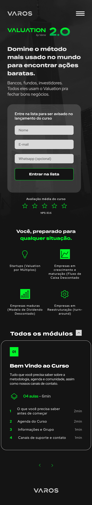

<p align="center">
  
  <br> 
  <br> 
  
</p>

<p align="center">
  
</p>

<h1 align="center">
    
</h1>

<br>


### A página é referente apenas a versão mobile da Lista de Espera de um dos cursos online, o Valuation: do Zero ao Avançado 2.0. 

<br>


## 🧪 Tecnologias

Esse projeto foi desenvolvido usando as seguintes tecnologias:
 
- [ReactJS](https://reactjs.org/)
- [Typescript](https://www.typescriptlang.org/)
- [Styled Components](https://styled-components.com/docs/basics)
- [Axios](https://axios-http.com/docs/intro)
<!-- - [JSON Server](https://api-sports.io/documentation/nba/v2#section/Introduction) -->

## 🚀 Iniciando o projeto

Clone esse repositório e acesse a pasta dele

```bash
$ git clone https://github.com/GersonRocha9/valuation-mobile.git
$ cd valuation-mobile
```

Execute os comandos abaixo:
```bash
# Instale as dependências
$ yarn

# Inicie o servidor (porta localhost:3000)
$ json-server --watch db.json  

# Inicie o projeto (porta localhost:3001)
$ yarn dev
```


## 📝 Licença

This project is licensed under the MIT License. See the [LICENSE](LICENSE.md) file for details.

---

Feito por [Gerson Rocha](https://www.linkedin.com/in/gersonrocha/)
